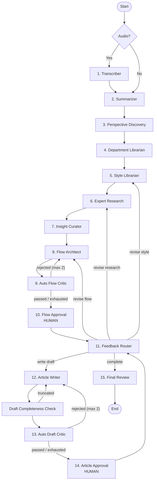

# Project Report — Writing Club

**A multi-agent AI editorial organization built with LangGraph**

*Prepared: October 2026 · Repository: `writing-club` · License: MIT*

---

## 1. Executive Summary

I kept hitting the same wall while building with LangGraph: the examples all model agents as **generic workers** — a researcher, a writer, a reviewer — and the interesting part was always the *orchestration mechanics* (state, routing, interrupts, retries).

So I asked a different question: **what if the agents weren't just "agents"?**

What if each one represented an actual **person** in a real organization — a department, a role, a distinct area of expertise with its own accountability? And what if instead of asking one model to do everything, I built a **small organization** where each part of the system has a narrow responsibility, reports to a peer, and can send work back?

**Writing Club** is the answer. It models a publication house as a 15-agent LangGraph state machine. Raw ideas, typed briefs, or a rambling 4-minute voice memo go in one end; a finished, voice-matched article comes out the other — with the AI critiquing itself, routing its own corrections, and stopping to ask a human twice before calling it done.

The real goal was never "generate an article." It was to **replicate how I actually think when I write**, as an executable system.

---

## 2. The Core Idea

Most multi-agent demos answer *"how do I chain LLM calls?"* This project answers *"can an LLM system hold a role, a standard, and a memory of what went wrong?"*

| Concept | Implementation |
|---|---|
| Agents as **people**, not tools | 15 named roles with distinct mandates, reporting lines, and veto power |
| **Departments** | Intake, Planning, Research, Editorial, Verification |
| **Persistent org memory** | A "Library Room" of department definitions + author style profiles that compound across runs |
| **Accountability** | Independent critics who can reject a peer's output and send it back |
| **Escalation** | A feedback router that reads a rejection and picks *who* must fix it |
| **Human authority** | Two interrupt points where the AI cannot proceed without a person |
| **Resilience** | Multi-provider key failover down to a fully local model, so the pipeline never dies |

---

## 3. Architecture

A single `StateGraph` with **15 nodes across 5 phases**, checkpointed with `MemorySaver` so it survives interrupts and resumes exactly where it stopped.



### The five departments

**Intake** — *Transcriber, Summarizer*
Converts a voice memo to text (local Whisper → Gemini multimodal → OpenAI fallback), then compresses it into a clean summary. Strictly forbidden from introducing new ideas — it only cleans.

**Planning** — *Perspective Discovery, Department Librarian, Style Librarian*
Discovers 2–3 relevant academic angles; registers new departments into the persistent Library Room; and builds a **voice profile** (tone, pacing, narrative distance, signature moves, and things to avoid) that merges across runs so the AI converges on my actual voice instead of generic "assistant" prose.

**Research** — *Expert Research*
Each department reports from its own lens: key observations, blind spots in my argument, and concrete writing suggestions. Optionally consults a local SearXNG instance — but only when external evidence would genuinely help, never as a hard dependency.

**Editorial** — *Insight Curator, Flow Architect, Auto Flow Critic, Flow Approval, Feedback Router, Article Writer*
Deduplicates research into a curated insight set, proposes an outline, gets critiqued, asks a human, routes any rejection to the correct department, then writes the prose.

**Verification** — *Draft Completeness Check, Auto Draft Critic, Article Approval, Final Review*
Catches truncated generations (with its own independent retry budget), hunts AI tells and clichés, requests human sign-off, then writes a post-mortem.

---

## 4. The Two Design Decisions I'd Defend

### 1. Current-run correction, **not** system self-improvement

AI critics can reject a peer's output and route it back for revision — but the system **never rewrites its own prompts, code, graph, or State schema** based on article feedback.

```text
Current-run correction:   KEEP   (Flow Architect ↔ Flow Critic, Writer ↔ Draft Critic)
System self-improvement:  OFF    (no prompt/code/graph mutation)
```

Auto-revision is capped at 2 per critic to prevent loops, and once exhausted the draft still reaches a human — explicitly flagged as `requires_human_review`, so a failed draft can never be mistaken for an approved one.

This is deliberate. Self-modifying prompt pipelines are exciting demos and terrible engineering: they drift silently, and you lose the ability to explain why output changed. Bounded, auditable correction is the honest version of the idea.

### 2. Bounded authority, explicit escalation

Nobody finishes their own work. The Flow Architect doesn't approve its own outline — a critic does, and then a human does. The Article Writer doesn't ship — a critic screens it, and a human signs off. The Feedback Router reads the critique and decides *which department* is responsible, so "make it better" becomes an addressable, repeatable routing decision instead of a shrug.

---

## 5. Resilience & Model Routing

Tasks are routed by intent, not by a single global model (`config/model_config.py` → `TASK_POLICY`):

| Task class | Preference |
|---|---|
| Intake / summarization / discovery / auto-critique | Gemini Flash → OpenAI → Ollama |
| Research / critique / drafting / style learning | OpenAI → Gemini → Ollama |
| Last-resort | **Ollama (local, no key, no internet)** |

Keys support comma-separated *or* numbered formats. On a rate limit or API error, `utils/ask_llm.py` walks to the next key, then the next model in the task policy, then local Ollama. The pipeline is designed so that **a total cloud outage degrades quality but never halts the run**.

---

## 6. Tech Stack

- **Python 3.12+**, managed with **uv**
- **LangGraph 1.2.8** / LangChain — state graph, checkpointing, `interrupt()` HITL
- **Providers:** Google Gemini · OpenAI · NVIDIA NIM · Together · local Ollama
- **Interactive CLI** (`app.py`) — the primary and only supported interface
- **FastAPI + Uvicorn** (`server.py`) — optional headless JSON API, no bundled UI
- **openai-whisper** for local transcription
- **SearXNG** (optional) for untrusted-snippet web discovery
- **TypedDict state** (`state.py`) with a custom `operator.add` reducer for the append-only pipeline log

> **Interface note:** Writing Club is a **terminal application**. A browser frontend
> was started but never completed and has been removed from the repository (and
> gitignored). Because the workflow interrupts twice for human approval, the CLI is
> not a limitation — the terminal *is* where the decisions get made.

---

## 7. Repository Layout

```
writing-club/
├── graph.py            # StateGraph construction, routing, HITL interrupt nodes
├── state.py            # Global State schema + pipeline_log reducer
├── app.py              # Interactive CLI entrypoint
├── server.py           # FastAPI server
├── ai_acceptance_test.py  # Model latency/TTFT benchmark
├── employees/          # THE ORGANIZATION
│   ├── intake/         #   transcriber, summarizer
│   ├── planning/       #   perspective_discovery, librarian, style_librarian
│   ├── research/       #   expert_research
│   └── editorial/      #   insight_curator, flow_architect, auto_critics,
│                       #   feedback_router, article_writer,
│                       #   draft_completeness, final_article_review
├── prompts/            # One prompt template per agent role
├── models/             # DiscoveredPerspective, ExpertReport, WritingFlow
├── config/             # env.py (key parsing/failover), model_config.py (task policy)
├── utils/              # ask_llm, pipeline_logger, project_dumper, library,
│                       # prompt_loader, author_skill, searx_client
├── "library room"/     # PERSISTENT ORG MEMORY
│   ├── *.json          #   department definitions (auto-registered)
│   ├── writing styles/ #   author voice profiles (merged across runs)
│   └── author_skill.md
├── "About Team"/       # Org design docs: handbook, structure, workflow, state
├── articles/           # Sample outputs (top-level .txt kept; run folders ignored)
├── development_logs/   # Build journal
├── uploads/            # Local media input (gitignored)
└── searxng/            # Local search config (gitignored; example committed)
```

**Removed from the repo:** `frontend/` — an unfinished browser UI. The app is
CLI-first, and the WIP frontend was never functional, so it is gitignored and
excluded from version control. `server.py` still auto-serves a `frontend/`
directory if you ever build your own.

---

## 8. Repository Security Audit

I ran a full audit before preparing this for GitHub. Findings and remediation:

### 🔴 CRITICAL — live NVIDIA API key committed in plaintext

`ai_acceptance_test.py` hardcoded a real key:

```python
API_KEY = "nvapi-FPs0TAaiZ9o_..."   # committed in 66ac229
```

**Remediation applied:**
- Replaced with `os.getenv("NVIDIA_API_KEY", "")` + a clear failure message if unset.
- Rewrote git history (`filter-branch` + index-filter) to purge the blob from the commit, preserving all 4 commits and their messages.
- Cleared `refs/original`, expired reflogs, and ran `git gc --prune=now --aggressive`.
- **Verified: no reachable commit and no stored blob contains the key.**

> ⚠️ **ACTION REQUIRED:** The key was on disk in plaintext, so treat it as compromised. **Revoke and regenerate it at build.nvidia.com before pushing**, even though history is now clean.

### 🔴 HIGH — personal voice memo tracked in git

A 4.2 MB `WhatsApp Audio 2026-08-22 at 10.55.16.mp4` was committed under `uploads/`. Personal audio, irrelevant to the project, and the single largest object in the repo.

**Remediation:** Untracked and `uploads/` gitignored. The file remains on local disk; only the directory placeholder (`.gitkeep`) is tracked.

### 🟡 MEDIUM — SearXNG instance secret committed

`searxng/settings.yml` contained a generated `server.secret_key`.

**Remediation:** `searxng/` gitignored; committed `searxng/settings.yml.example` with a `CHANGE_ME` placeholder and instructions to generate a fresh key.

### 🟡 MEDIUM — `.gitignore` too thin

Original file covered only `__pycache__/`, `*.py[oc]`, `build/`, `dist/`, `wheels/`, `*.egg-info`, `.venv`, `.env`. It **did not** cover `.uv-cache/`, tooling caches, `uploads/`, or generated run artifacts.

**Remediation:** Full rewrite covering Python artifacts, virtualenvs, `.env` (with `!.env.example`), IDE/OS files, test and type-checker caches, personal media, local service configs, and generated run folders.

> Two subtleties handled deliberately: directory exclusions use `uploads/*` (not `uploads/`) so the `.gitkeep` negation can actually re-include the file — git does not descend into an excluded directory. And `articles/*/` (trailing slash) ignores only *run folders*, keeping top-level sample articles trackable.

### 🟢 Removed entirely

- `.agents/` — empty, referenced by no code
- `fuzzytesting/` — a 0-byte placeholder test plus `__pycache__`; now gitignored as scratch

### Other fixes

- Added **`.env.example`** documenting every variable, both multi-key formats, Ollama, and SearXNG — previously there was no template, only a 12-line `.gitignore`.
- Added **MIT LICENSE** (was absent → default all-rights-reserved).
- Replaced the `description = "Add your description here"` placeholder in `pyproject.toml`.

### Final verification

```text
Secrets in working tree ........... CLEAN
Secrets in git history ............ CLEAN (purged + gc'd)
Personal media in git ............. NONE
.env tracked ...................... NO
.env.example tracked .............. YES
Graph still compiles .............. OK
```

---

## 9. Honest Limitations

- **Tuned to one author.** The Library Room encodes *my* voice. Transferring to another writer needs a different style corpus.
- **Auto-critics are not judges.** They're the same model class critiquing itself; they catch tropes and weak structure, not factual errors. Verification stays human.
- **Costs add up fast.** 15 nodes with retry loops means many calls per article. The Ollama fallback exists precisely because this is real money.
- **Search snippets are untrusted.** SearXNG output is discovery-level only and is never treated as verified fact.
- **Output length is the hard problem.** Truncated drafts were common enough to justify a dedicated `Draft Completeness Check` node with its own retry budget.

---

## 10. What's Next

- Parallelize independent research agents within a phase (currently sequential)
- Real unit tests around routing logic (the graph is the fragile part)
- A/B the auto-critics against a no-critics control to prove they earn their cost
- Structured-output enforcement instead of prompt-parsed JSON for agent returns
- *If there's appetite:* a real web UI later — but it's a genuine project, not a
  weekend skin. The API in `server.py` is already shaped for one.

---

## 11. Running It

```bash
git clone https://github.com/HarpreetSingh2005/writing-club.git
cd writing-club
uv sync
cp .env.example .env      # then fill in your keys
```

**The app is a terminal application — this is the way to run it:**

```bash
uv run app.py                      # interactive, fully prompt-driven
uv run app.py uploads/note.mp3     # start from a voice memo
```

It pauses twice for your approval — once at **Flow Approval** (outline/tone/argument),
once at **Article Approval** (the draft). Type `y` to approve, or reject with feedback
and the Feedback Router sends the work back to whichever department owns the problem.

Optionally, drive the same pipeline over HTTP (headless, no UI attached):
```bash
uv run server.py                   # http://localhost:8000
```

Optional: run SearXNG separately and copy `searxng/settings.yml.example` → `settings.yml` to enable web research.
