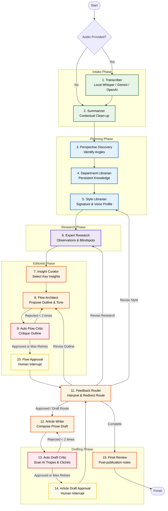

# 🖊️ Writing Club: AI-Powered Multi-Agent Writing Organization

**Writing Club** is a state-of-the-art, multi-agent editorial pipeline powered by [LangGraph](https://github.com/langchain-ai/langgraph). It emulates a professional publication house, transforming raw ideas, text briefs, or voice transcripts into highly polished, human-sounding articles. 

Instead of generating an article in a single LLM prompt, the project routes inputs through **15 specialized AI agents ("employees")**, implements automated quality-assurance critics, and embeds interactive **human-in-the-loop approvals** to ensure the final output retains your voice and satisfies your editorial goals.

> **Interface: command line only.** Writing Club runs entirely in your terminal. There is **no web UI** — the pipeline pauses at two approval points and waits for you to type a decision, so the CLI *is* the interface. A browser frontend was started but never finished, so it has been removed from this repository.
>
> `server.py` exposes the same pipeline as a headless HTTP API for anyone who wants to drive it programmatically. It ships **no bundled UI** — bring your own client.

---

## 💡 The Idea

The usual LangGraph examples model agents as **generic workers** — a researcher, a writer, a reviewer — where the interesting part is the orchestration plumbing.

This project asks a different question: **what if the agents weren't just "agents"?** What if each one represented a *person* in a real organization — a department, a role with its own area of expertise, standard, and accountability?

So instead of one model solving everything, Writing Club is built as a **small organization**: every part has a narrow responsibility, hands its work to a peer, and can be sent back.

That question then leads to a harder one. If an AI system is meant to sound like a specific human, **how do you stop it from faking that human's mannerisms?**

An AI given a handful of stylistic rules will cheerfully produce polished prose wearing your signature moves — the CAPS, the rhetorical questions, the Hinglish, the rhetorical callback. It reads *like* you and thinks like nobody.

Writing Club's answer is the **Author Skill** and the Draft Critic's hard question:

> "Does this draft appear to reproduce the author's way of thinking, or is it assembling recognizable author-style tricks?"

Everything else in the architecture exists to answer that question honestly.

---

## ⚠️ What I Removed, and Why

Worth stating plainly, because it's the most useful lesson from the project.

I built a **self-improvement layer**: agents that inspect their own architecture, detect repeated failure patterns at a stage, and suggest a bug might live there. It worked, sort of — and it turned into more loops, more states, more interactions, for no measurable gain in output quality.

**More complexity does not automatically mean more intelligence.**

So that layer was removed. What remains is *bounded* correction — critics can reject a peer's output and route it back, but nothing is allowed to rewrite its own prompts, code, graph, or state. See [Current-Run Correction vs. System Self-Improvement](#-current-run-correction-vs-system-self-improvement) for exactly what the system still does.

```text
Current-run correction:   KEEP   (critic rejects → routes back to the owning department)
System self-improvement:  OFF    (no prompt / code / graph / state mutation)
```

---

## 🔍 When It Needs to Know Something It Doesn't

Reasoning from what the model already knows has a ceiling. When a department genuinely needs external evidence, researchers can optionally consult a local **SearXNG** instance (see [Optional Web Research](#-optional-web-research-searxng-tool)).

Search is a **tool, not an employee or a graph node**. A researcher reasons from its department perspective first and only requests searches when external information would materially change the report. An empty search plan means no web research happens at all. If SearXNG is unavailable or misconfigured, the pipeline continues with purely analytical research — it is never a hard dependency.

---

## 🏛️ System Architecture & Workflow

Writing Club is built on a modular state graph. The entire workflow consists of **15 distinct steps** organized into five core phases: **Intake**, **Planning**, **Research**, **Editorial**, and **Verification**.



---

## 🔁 Current-Run Correction vs. System Self-Improvement

Writing Club uses **AI Editorial Critique + Adaptive Current-Run Routing**:

- Each stage's output is reviewed by an AI critic.
- The critic evaluates the current output, identifies weaknesses, and decides the appropriate next action for the **current article**.
- The workflow routes back to the relevant agent (Flow Architect, Expert Research, Style Librarian, or Article Writer) for revision, then back through the critic.
- Human flow and article approvals remain part of the loop.

```text
Flow Architect → Flow Critic → revise_flow → Flow Architect
Article Writer → Draft Critic → revise_draft → Article Writer
```

This **current-run correction is intentionally kept**.

Writing Club does **not** perform system-level self-improvement. It does not automatically modify its own prompts, code, graph architecture, State schema, department definitions, or future run behavior based on article feedback.

---

## 🗂️ Step-by-Step Employee Nodes (How Each Step Works)

### Phase A: Intake
#### 1. Transcriber (`transcriber`)
*   **What it does:** Converts spoken audio into text.
*   **How it works:** If the user supplies an audio file path, it attempts local transcription using an OpenAI Whisper `base` model. If local resources fail, it falls back to Gemini's multimodal API (uploading the file) or OpenAI's remote Whisper API.

#### 2. Summarizer (`summarizer`)
*   **What it does:** Compresses and cleans the transcription without adding any new or external ideas.
*   **How it works:** It acts as a strict editor, fixing grammar mistakes, removing filler words, and structuring the raw spoken transcript into a coherent, condensed summary containing the core arguments.

---

### Phase B: Planning & Library Management
#### 3. Perspective Discovery (`perspective discovery`)
*   **What it does:** Identifies disciplines and specialized angles (e.g., Sociology, Philosophy, Biology) relevant to the topic.
*   **How it works:** It analyzes the summary and proposes a list of 2–3 academic or expert perspectives to research. This ensures the final article is rich and multi-dimensional.

#### 4. Department Librarian (`librarian`)
*   **What it does:** Manages the persistent library of academic departments (`library room/*.json`).
*   **How it works:** It groups discovered perspectives by department. If a department JSON does not exist in the library, it generates a description and schema metadata via an LLM. It then registers new sub-departments (or perspectives) to compile a growing index of intellectual angles.

#### 5. Style Librarian (`style librarian`)
*   **What it does:** Builds the writing identity the Writer and both critics actually judge against.
*   **How it works:** It combines two things:
    1. **The Author Skill** (`library room/author_skill.md`) — a hand-authored, stable document describing the author's *decision-making*, not a template. It's organized into three tiers: **Tier 1** identity and thought process (dominant), **Tier 2** frequent writing behaviors, **Tier 3** optional stylistic tools that must never be treated as requirements.
    2. **The dynamic style profile** (`library room/writing styles/*.json`) — detected per article, merged persistently across runs so the model converges on the author's voice over time.

    An `author_skill_selector` step then selects which tendencies from the stable Author Skill apply to *this* article, producing a dynamic `author_skill` block that rides along in the State for the Writer and both Critics.

> **Why the tiers matter.** This is the project's central idea in practice: reproduce the author's *way of developing ideas* (notice → question → disrupt → reframe → explain), not his recognizable surface tricks (CAPS, Hinglish, rhetorical questions, gaming references). A draft that crams in Tier 3 devices without the Tier 1 reasoning behind them is a failure, not a success.

> **Tone is not a user input.** It used to be. It now emerges from the source material + the Author Skill + the subject. `requested_tone` survives in `State` only for backward compatibility, and the CLI no longer prompts for it.

---

### Phase C: Research
#### 6. Expert Research (`expert research`)
*   **What it does:** Conducts research and generates reports from the perspective of each selected department.
*   **How it works:** Armed with the department descriptions, the agent analyzes the summary and writes a structured report containing key academic observations, potential risks/blind spots in the author's argument, and specific writing suggestions.

---

### Phase D: Editorial & Structure
#### 7. Insight Curator (`insight curator`)
*   **What it does:** Selects the most critical research points.
*   **How it works:** It acts as an editorial filter, scanning all expert research reports, deduplicating findings, and selecting the most impactful, non-conflicting points to include in the draft.

#### 8. Flow Architect (`flow architect`)
*   **What it does:** Proposes a structured outline (flow) for the article.
*   **How it works:** Using the curated insights and the Author Skill + style profile, it creates an outline containing a suggested title direction, tone, core argument, section-by-section breakdown, and an approval question for the user.

---

### Phase E: AI Editorial Critique, Current-Run Routing & Human Approvals
#### 9. Auto Flow Critic (`auto flow critic`)
*   **What it does:** Performs an automated quality check on the proposed outline.
*   **How it works:** It evaluates the outline for generic writing structures, weak arguments, or boring section transitions. If it fails, it rejects the outline and loops back to the *Flow Architect* with feedback (capped at 2 automatic revisions to prevent infinite loops).

#### 10. Flow Approval (`flow approval`) — *Human Interrupt*
*   **What it does:** Pauses the graph to seek user approval for the proposed outline.
*   **How it works:** An interactive terminal prompt halts execution, printing the proposed title, tone, argument, and sections. The user can either type `y` to approve and proceed, or reject and provide feedback.

#### 11. Feedback Router (`feedback router`)
*   **What it does:** Determines the routing path based on review stage and user/critic feedback.
*   **How it works:**
    *   **Approved with no feedback:** Fast-paths to the next phase (outline approved → go to `article writer`; draft approved → go to `final article review`).
    *   **Feedback provided:** Uses an LLM to route feedback to the best-suited department (e.g. `style librarian` to adjust voice, `expert research` to gather more facts, `flow architect` to restructure outline, or `article writer` to rewrite draft).

#### 12. Article Writer (`article writer`)
*   **What it does:** Composes the full article draft.
*   **How it works:** Using the approved outline, the raw transcript, the intake summary, expert reports, curated insights, and the Author Skill + style profile, it writes the entire prose piece against the target word count. It writes *from* the source reasoning rather than assembling recognisable style tricks — that distinction is what the Draft Critic exists to police.

#### 13. Auto Draft Critic (`auto draft critic`)
*   **What it does:** Judges whether the draft is genuinely the author's thinking, and whether it is *true to the source*. This is the strictest node in the graph.
*   **Primary question:**
    > "Does this draft appear to reproduce the author's way of thinking, or is it assembling recognizable author-style tricks?"

*   **How it works:** It runs four families of checks, all against the **raw transcript** rather than the summary:

  **a) Source traceability — hallucination detection.** The raw transcript is the ultimate authority (the summary is only a preservation aid). Every concrete scene, detail, emotional state, reaction, or claim is classified as:
  1. `SOURCE-SUPPORTED`
  2. `REASONABLE AUTHORIAL EXPANSION` (develops the reasoning without adding a new factual claim)
  3. `UNSUPPORTED INVENTION` — **hard rejection, no matter how polished the prose is.**

  The critic is explicitly forbidden from *asking for* invented sensory detail to make the draft more vivid. Plausibility is not a defence: "probably true" is still fabrication.

  **b) Author-voice match.** Nine named failure modes are checked explicitly:
  | | Failure mode |
  |---|---|
  | **A** | Style-trick imitation — devices inserted because they appear in the Author Skill, without the reasoning that would justify them |
  | **B** | Polished AI conversational voice — generic phrasing, perfectly rounded transitions, evenly paced sentences |
  | **C** | Over-explanation — explaining a realization multiple times instead of letting it land |
  | **D** | Manufactured humor — jokes inserted because humor seems expected |
  | **E** | Sophisticated vocabulary dressing up a simple thought |
  | **F** | Source fabrication |
  | **G** | Motivational wrap-up instead of a natural landing point |
  | **H** | Tone performance — visibly alternating between "funny" and "serious" |
  | **I** | Generic inspirational transformation — replacing a specific realization with a safer universal lesson |

  **c) Craft and tone.** Transition tropes and clichés ("In conclusion", "It's crucial to note", "A testament to"), monotone sentence pacing, unearned analogies, preachy advice, performed tone, idea drift, paragraph flow, and length fit against the target word count.

  **d) Two verdicts it is expected to issue:**
  - *"Technically good, but does not feel like the author."* — clean prose, wrong reasoning and reader relationship.
  - *"The draft is over-performing the author's surface quirks."* — signatures crammed in without the underlying thinking.

*   **Rejection threshold:** any human-likeness rating below **8.5**, or any failure of the above, sets `approved: false`. Failures route back to the *Article Writer* with concrete replacement instructions (capped at 2 auto-revisions, then it escalates to a human explicitly flagged as `requires_human_review`).

#### 14. Article Approval (`article approval`) — *Human Interrupt*
*   **What it does:** Pauses the graph to seek user approval for the final draft.
*   **How it works:** Halts execution and prints the complete drafted article. The user can approve the draft or suggest edits, which the *Feedback Router* will evaluate and route accordingly.

#### 15. Final Review (`final article review`)
*   **What it does:** Performs a post-mortem review of the final approved article.
*   **How it works:** Compares the final approved article against the initial requirements. It notes what went well, what needed correction, and stores the outcome in the project archive. It does not modify, store, or propose changes to the system.

---

## 💾 Project Dumper & Outputs

Once the final draft is approved, the system writes two packets into a per-article folder under `/articles`:

**Before approval** (`save_review_packet`):
- `draft_for_review.txt` — the draft awaiting your decision
- `review_context_report.txt` — the context needed to judge it

**After approval** (`save_project_dump`):
- `article.txt` — the final article
- `improvement_report.txt` — what the Final Review recorded
- `project_log.txt` — time-stamped log of every agent action and rating score (e.g. `🤖 [Auto Flow Critic] Rated outline: 9.2/10`)

Style profiles and expert reports are carried across runs in the persistent Library Room rather than duplicated into every archive.

---

## 🔌 API Key switching & Task Routing

The system includes a resilient model configurator (`config/model_config.py`) that matches specific models to specific tasks:
- **Intake / Summarization / Discovery / Auto-critique:** Routed to faster, cost-effective models (Gemini `gemini-3.6-flash`).
- **Research / Critique / Drafting / Style learning:** Routed to higher-quality prose and reasoning models (OpenAI `gpt-5.6-terra`, `gpt-5.6-luna`).
- **Research fallback:** NVIDIA-hosted `meta/llama-3.3-70b-instruct`.
- **Last resort:** local Ollama (see below).

### API Key Fallback Formats
You can configure fallback keys in your `.env` file in two ways:

1. **Comma-Separated Values:**
   ```text
   GEMINI_API_KEYS=key1,key2,key3
   OPENAI_API_KEYS=key1,key2
   ```
2. **Numbered Keys:**
   ```text
   GEMINI_API_KEY_1=key1
   GEMINI_API_KEY_2=key2
   ```

If a provider returns a rate limit or API error during execution, `utils/ask_llm.py` automatically retries with the next key, then falls back to the next preferred model in the `TASK_POLICY` matrix.

### Local Fallback (Ollama)

A local **Ollama** model is the final safety net in every task chain. It is only queried when **all** cloud providers fail, so the pipeline never stops. It requires neither an API key nor internet.

To use it: install [Ollama](https://ollama.com), pull a model (e.g. `ollama pull llama3.2`), and keep the server running (`ollama serve`).

```text
OLLAMA_BASE_URL=http://localhost:11434   # local Ollama server
OLLAMA_MODEL=llama3.2                    # any model you have pulled
OLLAMA_ENABLED=true                      # set false to disable the fallback
```

---

## 🔎 Optional Web Research (SearXNG Tool)

Expert Researchers can optionally consult a **local SearXNG** instance for external evidence. SearXNG is a **tool**, not an employee or graph node — researchers reason from their department perspective first, and only request searches when external information (studies, statistics, case studies, verification, competing viewpoints) would materially improve the report.

### How it works
1. Each researcher reasons from its assigned department/perspective and returns an analytics report plus an optional `search_plan`.
2. An empty search plan means no web research is performed (the analyst call alone produces the final report).
3. If searches are planned, the node runs up to **3 queries total** (2 initial + 1 follow-up), capped at **5 results per query**. Search is optional and never blocks the pipeline.
4. Search snippets are treated as **untrusted discovery-level evidence**, never verified facts. Only URLs actually returned by SearXNG may appear in a report's `web_sources`.
5. If SearXNG is unavailable, misconfigured, or times out, the researcher continues with purely analytical research (web research is never a hard dependency).

### Minimal local setup
Run SearXNG separately (not managed by Writing Club), e.g. with Docker:

```bash
docker run -d -p 8080:8080 -v "$PWD/searxng:/etc/searxng" searxng/searxng
```

JSON output must be enabled in the instance's `settings.yml`:

```yaml
search:
  formats:
    - html
    - json
```

Verify it responds with JSON (not HTML):

```bash
curl "http://localhost:8080/search?q=test&format=json"
```

### Configuration (`.env`)
```text
SEARXNG_URL=http://localhost:8080   # leave empty/unset to disable web research
SEARXNG_TIMEOUT=10                   # per-request timeout in seconds
SEARXNG_ENABLED=true                 # auto-detected from SEARXNG_URL; can be forced off
```
Web research is disabled by default unless `SEARXNG_URL` is set in `.env`.

---

## 🛠️ Getting Started

### Prerequisites
- Python 3.12 or newer
- [`uv`](https://docs.astral.sh/uv/) (the project is managed with `uv`)
- At least one LLM provider API key — or a local [Ollama](https://ollama.com) install as a fallback

### 1. Installation
```bash
git clone https://github.com/HarpreetSingh2005/writing-club.git
cd writing-club
uv sync
```

### 2. Configure Environment Variables
Copy the template and fill in your keys:
```bash
cp .env.example .env
```
`.env` is gitignored — never commit it. Minimum viable config:
```text
GEMINI_API_KEY=your_gemini_key
OPENAI_API_KEY=your_openai_key
NVIDIA_API_KEY=your_nvidia_key
```
If you'd rather run fully local, set `OLLAMA_ENABLED=true` and pull a model (`ollama pull llama3.2`) with `ollama serve` running — that becomes the fallback when cloud providers fail.

### 3. Run the App

**This is the primary way to use Writing Club:**
```bash
uv run app.py
```

You'll be asked for source material and a target word count:

```text
Source material:
  1. Write or paste your own idea/transcript
  2. Provide an audio file path
  3. Use the built-in demo transcript
Choice [1/2/3]:
```

- **1** — type or paste your idea, rough notes, or a transcript (press Enter twice to finish)
- **2** — point at an audio file and let the Transcriber handle it
- **3** — run the built-in demo transcript to see the whole pipeline work without writing anything

Then enter your target word count (e.g. `800`). **There is no tone prompt** — tone is derived from your source material, the Author Skill, and the subject.

The pipeline runs phase by phase, printing every agent's action as it happens, and stops twice for your approval:

1. **Flow Approval** — review the proposed title, tone, core argument, and section breakdown.
2. **Article Approval** — review the finished draft.

Reply `y` to approve, or reject with feedback describing what should change. Feedback gets routed back to whichever department is responsible — style, research, structure, or the draft itself.

> If a critic rejects something after exhausting its auto-revisions, the prompt is explicitly flagged `⚠️ REQUIRES HUMAN REVIEW`. Approving at that point is recorded as a human override, not a pass.

Start from a voice memo directly:
```bash
uv run app.py uploads/my_voice_memo.mp3
```

Supported audio/video extensions: `.mp3 .wav .m4a .ogg .flac .aac .webm .mp4`

### Running as an HTTP API (optional)
```bash
uv run server.py       # serves on http://localhost:8000
```
This is a **headless JSON API** — there is no web interface attached, so `http://localhost:8000/` itself will 404. Use the endpoints directly:

| Method | Endpoint | Purpose |
|---|---|---|
| `POST` | `/api/start` | Upload audio or text, start the workflow |
| `GET` | `/api/status/{id}` | Current state and pipeline log |
| `POST` | `/api/approve/{id}` | Approve/reject with feedback |
| `GET` | `/api/result/{id}` | The final draft |

### Where output goes
Approved articles and full review packets are written to `/articles`. Each run gets a folder containing `article.txt`, `project_log.txt`, `review_context_report.txt`, and `improvement_report.txt`. Those run folders are gitignored; a few sample articles are kept at the top level.

---

## 🔁 Pipeline Limits

Two independent retry budgets, so one can't starve the other:

| Guard | Value | Purpose |
|---|---|---|
| `MAX_AUTO_REVISIONS` | `2` | Critic rejections per article, before escalating to a human |
| `MAX_TRUNCATION_RETRIES` | `1` | Draft Completeness Check regenerations — does **not** consume an auto-revision, because a truncated generation is a failure, not a bad draft |

After the caps are hit, the draft still reaches the approval prompt — but flagged, never silently passed.
